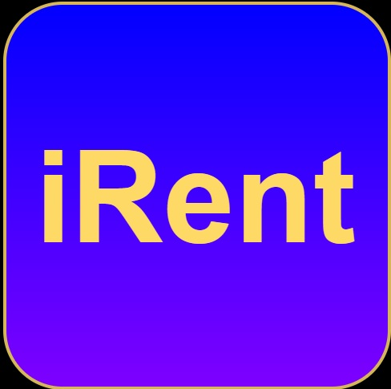
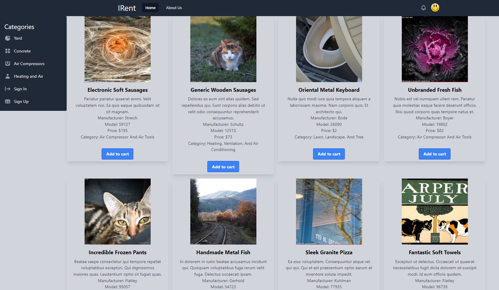

<div id="top"></div>

[![Forks][forks-shield]][forks-url]
[![Issues][issues-shield]][issues-url]
[![LinkedIn Scott][linkedin-shield-scott]][linkedin-url-scott]
[![LinkedIn Scott][linkedin-shield-braxton]][linkedin-url-braxton]
[![LinkedIn Scott][linkedin-shield-ben]][linkedin-url-ben]


<!-- PROJECT LOGO -->
<br />
<div align="center">
  <a href="https://github.com/sagreenxyz/milestone-3-project">
    
  </a>

  <p align="center">
    iRent is an app where users can view and order rental equipment for various types of projects!
    <br />
    <a href="https://github.com/sagreenxyz/milestone-3-project"><strong>Explore the docs »</strong></a>
    <br />
    <br />
    <!-- <a href="https://github.com/othneildrew/Best-README-Template">View Demo</a> -->
    ·
    <a href="https://github.com/sagreenxyz/milestone-3-project/issues">Report Bug</a>
    ·
    <a href="https://github.com/sagreenxyz/milestone-3-project/issues">Request Feature</a>
  </p>
</div>


<!-- TABLE OF CONTENTS -->
<details>
  <summary>Table of Contents</summary>
  <ol>
    <li>
      <a href="#about-the-project">About The Project</a>
      <ul>
        <li><a href="#built-with">Built With</a></li>
      </ul>
      <ul>
        <li><a href="#api">API</a></li>
      </ul>
      <ul>
        <li><a href="#app">APP</a></li>
      </ul>
    </li>
    <li>
      <a href="#getting-started">Getting Started</a>
      <ul>
        <li><a href="#prerequisites">Prerequisites</a></li>
        <li><a href="#installation">Installation</a></li>
      </ul>
      
    </li>
    <li><a href="#usage">Usage</a></li>
    <li><a href="#contributing">Contributing</a></li>
    <li><a href="#contact">Contact</a></li>
    <li><a href="#acknowledgments">Acknowledgments</a></li>
  </ol>
</details>


<!-- ABOUT THE PROJECT -->
## About The Project
<div align="center">
  <a href="https://github.com/sagreenxyz/milestone-3-project">
    
  </a>
</div>

iRent is an application that resembles a customer-facing website for a fictional equipment rental company.This allows for many ideas to be built upon. For a minimum viable product, allow customers to register, view available equipment, and add rental equipment to their cart.  Authorization is provided to allow employees and admins the ability to edit equipment, delete equipment, and check equipment back into the list of available rentals.

<p align="right">(<a href="#top">back to top</a>)</p>

### API

| Method | Path                                 | Purpose                                   | Authorized            |
| ------ | ------------------------------------ | ----------------------------------------- | -------------------   |       
| GET    | /                                    | Home page                                 | user, employee, admin |
| GET    | /equipment                           | Equipment index page                      | user, employee, admin               |
| POST   | /equipment                           | Create new equipment                      |  employee, admin                    |
| GET    | /equipment/:id                       | Details about a particular piece of equipment      | user, employee, admin      |
| PUT    | /equipment/:id                       | Update a particular piece of equipment             | employee, admin            |
| DELETE | /equipment/:id                       | Delete a particular piece of equipment             | employee, admin            |
| GET    | /category/:name                      | View equipment by category                         | user, employee, admin                      |

### APP

| Path                  | Component                 | Purpose                                                                         |
| --------------------- | ------------------------- | ------------------------------------------------------------------------------- |
| /                     | `Home.js`                 | Home page                                                                       |
| /sign-up              | `users/SignUpForm.js`     | Form for creating a new user                                                    |
| /equipment               | `equipment/""`    | List of places                                                                  |
| /equipment/new           | `equipment/""`  | Form for creating a new place                                                   |
| /equipment/:id      | `equipment/""`  | Details of a place, including it's comments, and a form to create a new comment |
| /equipment/:id/edit | `equipment/""` | Form for editing a place                                                        |
| /category/:name     | `category/""`  |                                                                                   | 

<p align="right">(<a href="#top">back to top</a>)</p>

### Built With

* [![Next][Next.js]][Next-url]
* [![React][React.js]][React-url]
* [![TailwindCSS][TailwindCSS]][Tailwind-url]
* [![NextAuth][NextAuth.js]][NextAuth-url]
* [![Node][Node.js]][Node-url]
* [![Prisma][Prisma.io]][Prisma-url]
* [![Postgresql][Postgresql.org]][Postgresql-url]

<p align="right">(<a href="#top">back to top</a>)</p>


<!-- GETTING STARTED -->
## Getting Started

This is an example of how you may give instructions on setting up your project locally.
To get a local copy up and running follow these simple example steps.

### Prerequisites

This is an example of how to list things you need to use the software and how to install them.
* npm
  ```sh
  npm install npm@latest -g
  ```

### Installation

<p align="right">(<a href="#top">back to top</a>)</p>

<!-- USAGE EXAMPLES -->
## Usage

<p align="right">(<a href="#top">back to top</a>)</p>

<!-- CONTRIBUTING -->
## Contributing

If you have a suggestion that would make this better, please fork the repo and create a pull request.

1. Fork the Project
2. Create your Feature Branch (`git checkout -b feature/NewFeature`)
3. Commit your Changes (`git commit -m 'Add some NewFeature'`)
4. Push to the Branch (`git push origin feature/NewFeature`)
5. Open a Pull Request

<p align="right">(<a href="#top">back to top</a>)</p>

<!-- CONTACT -->
## Contact
<div align="center">
  <p align="center">
    Benjamin Froehlich - bdfroehlich0@gmail.com
    <br />
    <a href="https://github.com/bdfroehlich"><strong>Benjamin's Github »</strong></a>
    <br />
    <br />
    Scott Green - email@domain.com
    <br />
    <a href="https://github.com/sagreenxyz"><strong>Scott's Github »</strong></a>
    <br />
    <br />
    Braxton Allen - email@domain.com
    <br />
    <a href="https://github.com/Vivonzty15"><strong>Braxtons's Github »</strong></a>
    <br />
    <br />
  </p>
</div>


<p align="right">(<a href="#top">back to top</a>)</p>


<!-- ACKNOWLEDGMENTS -->
## Acknowledgments

Use this space to list resources you find helpful and would like to give credit to. I've included a few of my favorites to kick things off!

* [Img Shields](https://shields.io)
* [SWR](https://swr.vercel.app/)
* [Othneildrew Best Readme](https://github.com/othneildrew/Best-README-Template)

<p align="right">(<a href="#top">back to top</a>)</p>


<!-- MARKDOWN LINKS & IMAGES -->
<!-- https://www.markdownguide.org/basic-syntax/#reference-style-links -->
[forks-shield]: https://img.shields.io/github/forks/sagreenxyz/milestone-3-project.svg?style=for-the-badge
[forks-url]: https://github.com/sagreenxyz/milestone-3-project/network/members
[issues-shield]: https://img.shields.io/github/issues/sagreenxyz/milestone-3-project.svg?style=for-the-badge
[issues-url]: https://github.com/sagreenxyz/milestone-3-project/issues
[linkedin-shield-scott]: https://img.shields.io/badge/-LinkedIn_Scott-black.svg?style=for-the-badge&logo=linkedin&colorB=555
[linkedin-url-scott]: https://www.linkedin.com/in/sagreenxyz/
[linkedin-shield-braxton]: https://img.shields.io/badge/-LinkedIn_Braxton-black.svg?style=for-the-badge&logo=linkedin&colorB=555
[linkedin-url-braxton]: https://www.linkedin.com/in/bnallen/
[linkedin-shield-ben]: https://img.shields.io/badge/-LinkedIn_Ben-black.svg?style=for-the-badge&logo=linkedin&colorB=555
[linkedin-url-ben]: https://www.linkedin.com/in/benjamin-froehlich-934650a2/
[irent-screenshot]: images/logo.JPG
[Next.js]: https://img.shields.io/badge/next.js-000000?style=for-the-badge&logo=nextdotjs&logoColor=white
[Next-url]: https://nextjs.org/
[React.js]: https://img.shields.io/badge/React-20232A?style=for-the-badge&logo=react&logoColor=61DAFB
[React-url]: https://reactjs.org/
[TailwindCSS]: https://img.shields.io/badge/TailwindCSS-35495E?style=for-the-badge&logo=vuedotjs&logoColor=4FC08D
[Tailwind-url]: https://tailwindcss.com/
[NextAuth.js]: https://img.shields.io/badge/NextAuth-DD0031?style=for-the-badge&logo=angular&logoColor=white
[NextAuth-url]: https://next-auth.js.org/
[Node.js]: https://img.shields.io/badge/Node.js-4A4A55?style=for-the-badge&logo=svelte&logoColor=FF3E00
[Node-url]: https://nodejs.org/en/
[Prisma.io]: https://img.shields.io/badge/Prisma.io-FF2D20?style=for-the-badge&logo=laravel&logoColor=white
[Prisma-url]: https://www.prisma.io/
[Postgresql.org]: https://img.shields.io/badge/Postgresql-563D7C?style=for-the-badge&logo=bootstrap&logoColor=white
[Postgresql-url]: https://www.postgresql.org/